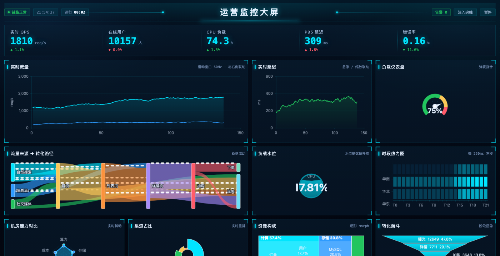
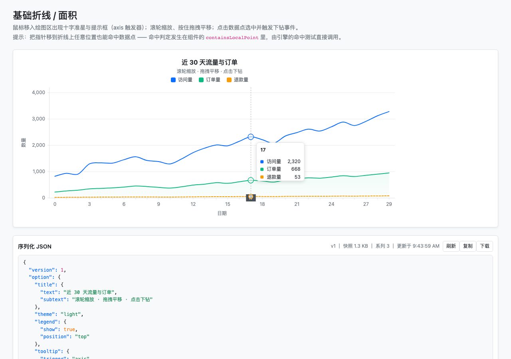
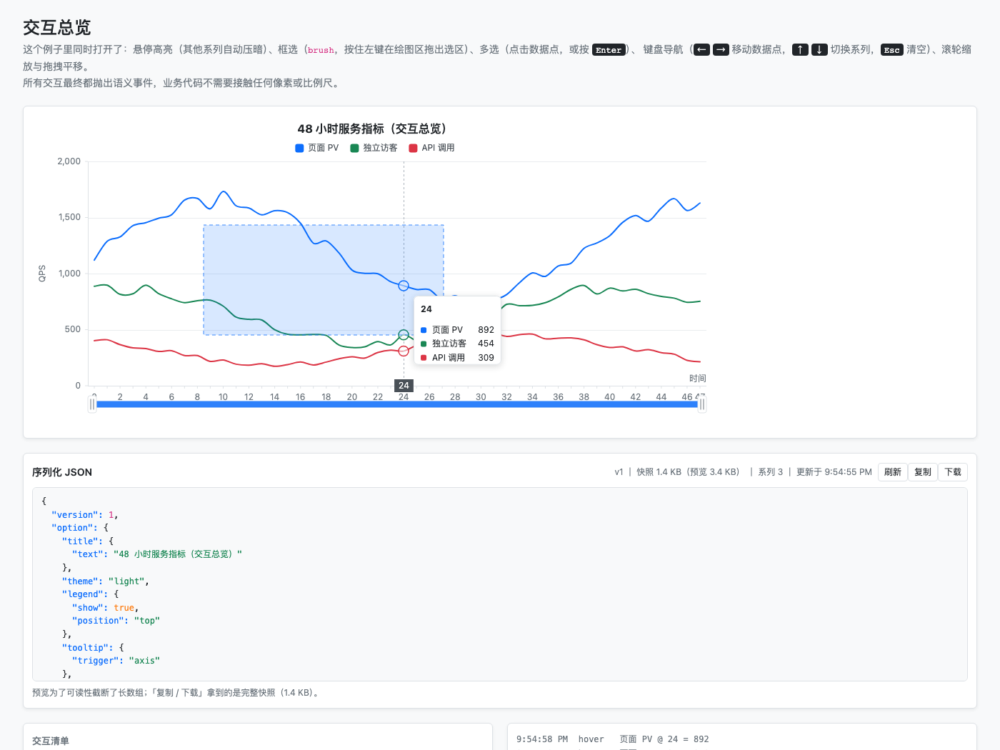
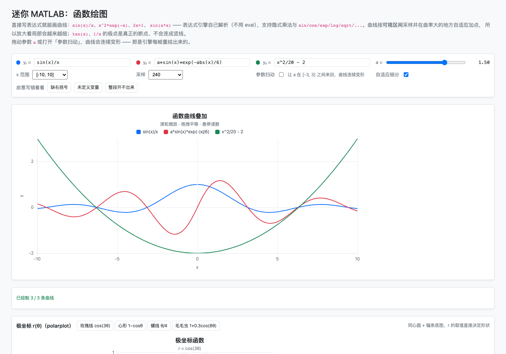
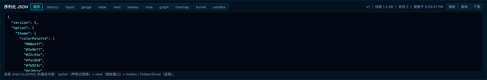
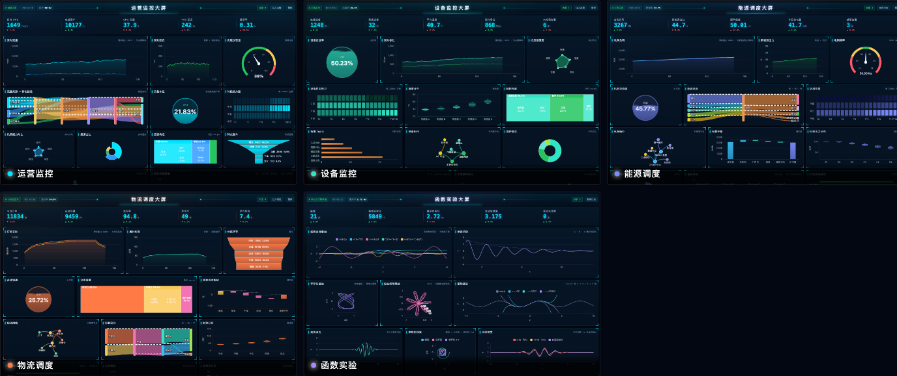

# ICEChart · 交互式图表库

[](https://www.npmjs.com/package/@damoqiongqiu/ice-chart)
[](https://www.npmjs.com/package/@damoqiongqiu/ice-chart)
[](./LICENSE)
[](https://github.com/ice-render/ice-chart/actions/workflows/ci.yml)

构建在 [ice-render](https://github.com/ice-render/ice-render) Canvas 引擎之上的**交互式图表库**。

它不是「把数据画成图」的又一个图表库 —— 命中测试、事件派发、嵌套坐标系、脏矩形局部重绘
全部交给 ice-render 引擎，图表层只负责把「数据 ↔ 像素 ↔ 语义事件」这三件事打通。
于是悬停、点击下钻、框选、缩放平移、图例联动、跨图联动、键盘导航都是**内建能力**，
而不是事后打补丁的插件。



## 快速开始

```bash
npm install @damoqiongqiu/ice-chart ice-render
```

> 包名带作用域不是偏好，是 npm 的「相似名保护」：无作用域的 `ice-chart` 与已存在的 `icechart`
> 太像，会被直接拒发，所以本包发布在 `@damoqiongqiu` 作用域下。

```ts
import { createChart } from '@damoqiongqiu/ice-chart';

const chart = createChart('canvas-id', {
  title: { text: '近 30 天流量' },
  tooltip: { trigger: 'axis' },
  interaction: {
    hover: { enabled: true, dimOthers: true },   // 悬停高亮 + 压暗其他系列
    select: { enabled: true, mode: 'multiple' }, // 点多选（或键盘 Enter）
    brush: { enabled: true, axes: 'x', mode: 'zoom' }, // 拖拽框选，直接当缩放用
    zoom: { enabled: true, axes: 'x', wheel: true },
    pan: { enabled: true, axes: 'x' },
    keyboard: true,
  },
  xAxis: { type: 'category' },
  yAxis: { name: '访问量' },
  series: [
    { id: 'pv', type: 'line', name: '访问量', data: [820, 932, 901, 1290] },
    { id: 'uv', type: 'area', name: '独立访客', data: [320, 402, 391, 520] },
  ],
});

chart.on('item:click', (params) => {
  console.log(params.seriesName, params.xValue, params.value, params.data);
});
```

`ice-render` 是 peer 依赖：一个页面上多张图共用同一个引擎实例池，跨图联动才有统一的事件语义。
包同时提供 ESM / CJS / UMD 三种产物与完整类型声明（`dist/types`），
Vite / webpack / Rollup 直接 import，Node 侧 `require('@damoqiongqiu/ice-chart')` 也拿得到 CJS。

浏览器直接用（CDN 或本地文件，注意引擎要先于图表引入）：

```html
<canvas id="chart" width="960" height="420"></canvas>
<script src="https://unpkg.com/ice-render/dist/index.umd.js"></script>
<script src="https://unpkg.com/@damoqiongqiu/ice-chart/dist/index.umd.js"></script>
<script>
  ICEChart.createChart('chart', { series: [{ type: 'line', data: [1, 3, 2] }] });
</script>
```

## 设计原则

**0. 视觉基调是 Bootstrap**

默认主题直接取 Bootstrap 5 的调色板与设计变量（primary / success / danger / warning / info、
gray-100~900、`--bs-border-radius`、`--bs-body-font-family`），图表放进 Bootstrap 页面里
与按钮、卡片、表格是同一套视觉语言。需要换品牌色时用 `theme: { colorPalette: [...] }` 覆盖即可，
或直接改 `BOOTSTRAP_TOKENS` 派生自己的主题。



**1. 交互是一等公民，命中判定写进组件**

每个系列组件都实现 `containsLocalPoint`：把组件本地坐标翻译成数据语义（离折线多近、落在哪根柱子里），
于是引擎的 `ice.hitTest()` / 事件派发**天然就认识数据点**，不需要在图表外面再写一套坐标反查。
代价是 0 —— 这套判定本来就写在同一个类里，还顺带复用了「画出来是什么样」的像素缓存。

**2. 像素缓存是渲染与命中的唯一事实来源**

`rebuildPixels()` 在数据 / 比例尺 / 尺寸变化时重算一次点集，`render()` 与 `hitTestIndex()` 消费同一份缓存。
「看得见的点」与「点得到的点」因此不可能漂移。

**3. 交互的视觉反馈是独立小组件**

鼠标在数据点上移动时，只有 `Highlight` / `Crosshair` / `Tooltip` 这三个覆盖层变脏，
脏矩形就是标记环那一小块像素 —— 折线与柱形完全不动。压暗其他系列只在「悬停系列变了」时
写一次 state，不会每帧把所有系列置脏。

下图是同一个页面上同时打开悬停 / 框选 / dataZoom 的样子：框选区域是独立覆盖层，
折线本身没有重绘，底部是语义事件日志。



**4. 声明式 spec 可序列化**

`ChartOption` 是纯 JSON（函数字段仅限 formatter），`chart.toJSON()` / `fromJSONString()` 可存盘、可进 DSL。
归一化（`normalizeOption`）与布局（`computeLayout`）都是**纯函数**，不依赖 DOM / ctx，可被完整单测。

**5. 跨图联动按数据值而不是像素**

`linkCharts()` 只用公开语义事件，并通过 `fractionOf / valueAtFraction` 这类**数据域比例**对齐，
不同尺寸、不同数据范围的图表也能联动。

## 能力清单

| 能力 | 状态 | 说明 |
| --- | --- | --- |
| 系列类型 | line / area / bar（含横向）/ scatter（含气泡）/ pie（含环形、玫瑰）/ radar / candlestick / heatmap / sankey / funnel / gauge / boxplot / waterfall / treemap / graph / function / parametric | 见下方「图表类型与写法」 |
| 比例尺 | linear / category / time / log | time 轴按跨度自动切换毫秒~年粒度 |
| 坐标系 | 直角坐标 / 极坐标（饼图） / 雷达 / 桑基图 | 按系列类型自动切换场景 |
| 坐标轴 | x + **多 y 轴**（左右可配） | 刻度、网格、轴名、标签旋转与自动抽稀、自定义 formatter、**数据域留白 `padding`（默认 5%）** |
| 图例 | top / bottom / left / right | **可点击切换系列 / 扇区显隐**并重算数据域 |
| 提示框 | axis / item 触发器 | 画在画布内（小程序同样可用）；K 线给 OHLC、桑基给流量 |
| 十字准星 | x / y / xy | 带坐标轴数值标签；跟随时长按距离缩放（`crosshair.followDuration`，默认上限 90ms，`0` = 立即跟随） |
| 悬停高亮 | 圆环 / 柱形描边 | 可配置 `dimOthers` 压暗其他系列 |
| 选中 | single / multiple | 点击或键盘 Enter，抛出 `select:change` |
| 框选 | x / y / xy，select / zoom 两种模式 | 拖拽出选区，实时抛 `brush:change` |
| 缩放 | 滚轮（data / viewport 两种模式） | 以指针位置为锚点，可配置 `minSpan / maxSpan` |
| 平移 | 拖拽 | 自动约束在完整数据域内 |
| 键盘导航 | ←/→ 移动数据点，↑/↓ 切换系列 | Enter 选中，Esc 清空；只由最后激活的图表响应 |
| 跨图联动 | hover / zoom / brush | `linkCharts([a, b])`，按 x 数据值对齐 |
| 动画 | 进入与数据更新 | 走引擎的 `AnimationManager`（`state.progress` 驱动） |
| 主题 | light / dark / 自定义片段 | 默认色板取自 ice-render 的设计 token |
| 大数据 | LTTB 降采样 + 二分命中 | 5 万点 × 3 系列构建 35ms，每条曲线只绘制约 2 点/像素 |
| 无障碍 | 数据表镜像 + aria-live 播报 | `attachA11yMirror()` / `getDataTable()` / `getA11yTree()` |

> **内置文案可配**：无障碍数据表的表头与默认 tooltip 标签可以用 `option.labels` 覆盖
> （`{ chart, sector, value, ratio, indicator, coordinate, liquid, slice }`，不传是中文默认值）。
> 图表包**不做 i18n 运行时** —— 词条与 `Intl` 格式化归应用层，`tooltip.formatter` 可以完全接管提示框；
> 断行与文字方向（`direction` / `textAlign: 'start' | 'end'`）由引擎负责。
> 边界契约见 ice-render 的 `docs/architecture/17-i18n-boundary.md`。
| 序列化 | `toJSON` / `fromJSONString` | 配置 + 缩放窗口 + 图例显隐状态 |
| 自定义系列 | `registerSeriesType(type, factory)` | 任何 `SeriesBase` 子类接入成一等系列：命中 / 悬停 / 提示框 / 图例 / 序列化全部自动生效 |
| 数据坐标图元 | `addMark()` | 注释卡片 / 阈值线 / 目标线 / 预测带挂在**数据坐标**上，缩放平移与数据更新后不脱锚；组件就是引擎图元（带命中、事件、动画） |
| 标注 | `option.annotation` | 目标线 / 阈值线、异常点、目标区间。**声明式、纯数据可序列化**，定位走坐标轴比例尺（随缩放 / 平移 / 联动走），默认不吃命中；越界不画但给结构化诊断（`annotationDiagnostics()`） |

> 「标注」与「数据坐标图元」是同一件事的两种形态，按场景选：
> 表单里填个数就出一条目标线 → `option.annotation`；需要拖动 / 点击 / 挂在图上做交互的注释卡片 → `addMark()`。

## 事件

所有事件都通过 `chart.on(name, handler)` 订阅：

| 事件 | 载荷 | 触发时机 |
| --- | --- | --- |
| `item:hover` | `DataPointParams` | 悬停数据点 / 数据列（axis 触发器取该列第一个点） |
| `item:leave` | — | 离开数据 |
| `item:click` | `DataPointParams` | 点击数据点（下钻的入口） |
| `item:dblclick` | `DataPointParams` | 双击数据点 |
| `plot:click` | `{ screen, xValue, yValue }` | 点击绘图区空白处 |
| `chart:click` | `{ screen }` | 点击画布（绘图区之外） |
| `select:change` | `DataPointParams[]` | 选中集合变化 |
| `brush:change` | `BrushRange \| null` | 框选拖动中（实时） |
| `brush:end` | `BrushRange \| null` | 框选结束 |
| `mark:drag` | `ChartMarkData` | 数据坐标图元被拖动（阈值线 / 注释被拖时实时抛） |
| `mark:dragend` | `ChartMarkData` | 图元拖动结束（此时锚点已写回数据坐标） |
| `zoom:change` | `ZoomRange` | 缩放 / 框选缩放的窗口变化 |
| `pan:change` | `ZoomRange` | 拖拽平移 |
| `legend:toggle` | `LegendToggleParams` | 图例切换系列 |

`DataPointParams` 同时携带 `dataIndex / xValue / value / data`（原始数据项）与 `screen` 像素坐标，
业务层做下钻、联动、埋点都不需要再碰比例尺。

## 图表类型与写法

每种类型都是「声明式 option + 相同的交互语义」，切换类型只需要改 `series[].type`。

| 类型 | 关键写法 | 说明 |
| --- | --- | --- |
| `line` / `area` | `data: [1, 2, 3]` 或 `[[x, y]]` | 平滑曲线 `smooth`、断点（`null` 断开）、面积 `areaOpacity` |
| `bar` | 类目在 x（默认） | 分组（多系列）与堆叠（同 `stack` 名）；数据项写 `{ value, color }` 可**逐项配色** |
| `bar`（横向） | `yAxis: { type: 'category', data: [...] }` + `xAxis: { type: 'value' }` | 排行榜；类目也可写在数据项的 `name` 上 |
| `scatter` | `data: [[x, y, size]]` + `symbolSizeRange` | 第三维映射成直径即气泡图；`symbolSize` 也可传函数 |
| `pie` | `data: [{ name, value }]` | `innerRadius` 出环形，`roseType` 出玫瑰图；扇区可点图例隐藏 |
| `radar` | `radar.indicators` + `data: [数值...]` | 一个系列一个多边形，顶点命中 |
| `candlestick` | `data: [[open, close, low, high]]` | 影线进数据域，提示框给 OHLC |
| `boxplot` | `data: [[min, Q1, median, Q3, max]]` 或一组原始观测值 | 恰好 5 个数按五数概括解释，其它长度自动算分位数；命中覆盖整条须 |
| `heatmap` | `data: [[x类目, y类目, 数值]]` | y 轴自动变类目轴，颜色线性插值 |
| `waterfall` | `data: [{ name, value }]`，合计项标 `total: true` | 增/减/合计三色 + 连接虚线 |
| `funnel` | `data: [{ name, value }]` | 阶段梯形、`minSize` 保护最小阶段、图例按阶段显隐 |
| `gauge` | `gauge: { min, max, axisLineColor }` + `data: [{ name, value }]` | 指针随数值转动，轴线按阈值分段配色 |
| `sankey` | `sankey: { nodes, links }` | 分层 + 纵向松弛布局，节点/连线分别命中 |
| `treemap` | `data: [{ name, value, children }]` | squarified 布局，父节点留标题带；命中返回最深节点 |
| `graph` | `graph: { nodes, links }` | 力导向布局（无底图），节点可拖拽重排；按分类配色、按权重定大小 |
| `function` | `expression: 'sin(x)/x'`（+ `params` / `domain` / `samples` / `adaptive`） | 迷你 MATLAB：直接写表达式画 `y = f(x)`，按可视区间重采样、y 轴自动贴合；默认**自适应细分**，`adaptive: false` 才是均匀采样 |
| `parametric` | `xExpression: 'sin(3*t)'` + `yExpression: 'cos(2*t)'` | 参数曲线（李萨如 / 螺线 / 心形线）；自变量是 `t` |
| `parametric`（极坐标） | `polarExpression: 'cos(3*t)'` + `polarGrid: true` | 极坐标 `r(θ)`（玫瑰线 / 心形线 / 螺线），配 `aspect: 'equal'` 出 MATLAB `polarplot` 观感 |
| `liquid` | `liquid: { min, max }` + `data: [{ name, value }]` | 水位球（数据大屏常客）：水位随数值升降、水面持续起伏；整球可命中 |

### 实时数据流

数据不断进来、图形跟着动（监控大屏 / 交易终端那类）走 `appendData`：

```ts
chart.appendData('cpu', [[t, value]], { maxPoints: 180 }); // 追加 + 滑动窗口
chart.appendData('cpu', [[t, v1], [t2, v2]], { maxPoints: 180, animate: true }); // 需要值插值时才开
```

- **滑动窗口**：追加到末尾，超过 `maxPoints` 从头裁掉；x 轴窗口自动跟着右移，不需要手动 `setDomain`；
- **默认不做值插值**：窗口滑动会让下标整体前移，插值会把每个点拖向「邻居的值」（看起来像被拖住）。
  流畅度由推送频率决定——60Hz 推送就是 60fps 的平滑滚动；
- 走常规更新路径 + `preserveView`（当前缩放窗口不受影响），并派发 `data:change`；
- 实测（2 系列、每 tick 各追加 1 点）：窗口 120 点 **1.6ms/tick**、600 点 4.9ms、1500 点 11ms
  —— 监控场景用 120~300 点的窗口最划算。

配套示例 [examples/live-stream.html](./examples/live-stream.html)：四条曲线共用一个数据发生器 ——
滑动窗口折线 / 弹簧指针仪表盘 / 每 250ms 左移一列的滚动热力图 / 最后一根实时跳动的 K 线，
外加暂停、1×/2×/4× 速度、注入尖峰与 fps 统计。

### 大屏（深色主题）

同一个脚手架（[examples/assets/dash-kit.js](./examples/assets/dash-kit.js)）下**六个大屏案例**，
每个只是「换一套视觉身份 + 换一张面板清单」：

| 大屏 | 视觉身份 | 侧重 |
| --- | --- | --- |
| [运营监控](./examples/dashboard.html) | 青 | 12 张图共用一条数据流，跨图三路联动 + 告警亮边 |
| [设备监控](./examples/dashboard-iot.html) | 青绿 | 水位球 / 设备状态热力 / 心跳 K 线 / 固件占比 |
| [行情监控](./examples/dashboard-market.html) | 琥珀 + 红涨绿跌 | 分时 / 盘口六档 / 资金流桑基 / 换手水位球 |
| [能源调度](./examples/dashboard-energy.html) | 蓝紫 | 源网荷桑基 / 电量平衡瀑布 / **谐波合成（函数绘图）** |
| [物流调度](./examples/dashboard-logistics.html) | 橙红 | 分拣漏斗 / 包裹流向 / 逐项配色的排名与时段柱 |
| [函数实验](./examples/dashboard-lab.html) | 紫 | 参数扫动 / 极坐标 / 采样密度 / 表达式诊断 |

`dash-kit` 只做三件事：注入共享 CSS（面板 / KPI 条 / 顶栏 / 底部快照面板）、
按 12 列栅格产出面板 HTML、跑主循环（`tick` + 暂停 + 倍速 + 供审计用的 `__dashLoop`）。
页面本身只写「配色变量 + 面板清单 + 数据怎么动」——新增一个大屏的量级是**一个 HTML 文件**。

以 [运营监控大屏](./examples/dashboard.html) 为例：

- 深色主题（`theme: 'dark'`）+ 自绘大屏外壳（KPI 卡片 / 面板标题栏 / 告警亮边）；
- 折线与延迟用 `appendData` 滑动窗口（60Hz），并用 `linkCharts` 做**悬停 / 缩放 / 框选三路联动**；
- **水位球**（`type: 'liquid'`）随 CPU 升降、水面持续起伏 —— 大屏里最有辨识度的一张；
- 仪表盘（弹簧指针）、雷达（实时抖动）、热力图（每 250ms 左移一列）按不同频率 `setData`；
- 玫瑰图 / 矩形树图 / 漏斗走更新动画做**重排过渡**（值变化时图形是滑过去的，不是瞬跳）；
- 桑基图开 `flow`，链路方向用流动虚线表达；
- CPU > 85% 时面板亮红边、顶部告警点亮起 —— 点「注入尖峰」看整屏反应；
- 底部是序列化 JSON 面板（12 张图切换查看各自的真实快照）。

> 外观按大屏的通用视觉基调重做过一轮（近黑蓝底 + 单一强调色 + 亮角面板 + KPI 分隔条），
> 布局用**严格 12 列栅格**（12 × 120px + 12px 间距 = 1572px 设计宽）：面板是列宽的整数倍，
> 画布宽 = 面板宽 − 内边距 − 边框，所以所有面板的左右边缘与内部留白完全对齐。
> 12 张图（含水位球）同时流动实测 41~60fps。
> 每个大屏的**画布左右留白都是 9/9**、所有面板左边缘都落在 132px 栅格上（脚本量测，不是目测）。

两个只在大屏里用得上的能力：

- **逐项配色**：数据项写成 `{ value, color }`，一个系列就能表达分级
  （承运商准时率、时段是否越限、机组出力档位），不必拆成多个系列把图形排成一组一组；
  横向排行榜按值排序后重建类目轴，「排名第一」永远在最上面。
- **`adaptive: false`**：函数系列默认按曲率**自适应细分**采样（所以只把 `samples` 调小看不出粗糙），
  显式关掉才是真正的均匀采样 —— 函数实验大屏里「9 点 / 40 点 / 自适应」三线同屏对照。

## 函数绘图（迷你 MATLAB）

```ts
ICEChart.createChart('chart', {
  aspect: 'equal', // 等比坐标：一个数据单位等长（画圆 / 参数曲线必开）
  xAxis: { type: 'value' },
  yAxis: {},
  series: [
    { type: 'function', name: 'sin(x)/x', expression: 'sin(x)/x', domain: [-10, 10] },
    { type: 'function', name: 'a·sin(x)·e^-|x|/6', expression: 'a*sin(x)*exp(-abs(x)/6)', params: { a: 1.5 } },
    { type: 'parametric', name: '李萨如', xExpression: 'sin(3*t)', yExpression: 'cos(2*t)', domain: [0, Math.PI * 2] },
  ],
});
```

表达式引擎是自研的（`src/expr/`，**不用 `eval` / `new Function`**，CSP 安全），
支持 `+ - * / % ^`、`sin/cos/tan/exp/log/sqrt/abs/min/max/clamp/...`、常量 `pi/e/tau`，
以及 MATLAB 习惯的**隐式乘法**（`2x`、`3sin(x)`、`2(x+1)`）。写错了会带上位置指针报错，
但**不会把图表搞崩**：`chart.expressionErrors()` 把原因交给表单去标红。

配套示例 [examples/mini-matlab.html](./examples/mini-matlab.html) 可以在页面上直接改公式、
拖参数、切换参数曲线与极坐标曲线：



### 怎么知道用户写错了公式

`chart.expressionDiagnostics()` 把三层检查合成一份结果（`error` 画不出来 / `warning` 多半不是本意）：

| 层 | code | 例子 | 级别 |
| --- | --- | --- | --- |
| 语法 | `syntax` / `unknown-character` / `unknown-function` / `arity` / `empty` | `sin(x`、`foo(x)`、`sin(1,2)` | error（带字符位置） |
| 静态 | `unknown-variable` | `b*sin(x)` 但没定义 `b` | error |
| 静态 | `unused-parameter` | `params: {a: 1}` 但表达式里没有 `a` | warning |
| 运行 | `no-finite-values` | 整段 `sqrt(-1-x^2)`、`log(0*x-1)` | error |
| 运行 | `constant-value` | `sin(0)`，画出来是一条水平线 | warning |

```ts
for (const { seriesId, diagnostics } of chart.expressionDiagnostics()) {
  for (const d of diagnostics) {
    // d.severity: 'error' | 'warning'；d.code 见上表；d.position 只有语法类才有
    markInputRed(seriesId, d.message + (d.position === undefined ? '' : `（位置 ${d.position}）`));
  }
}
chart.expressionErrors(); // 只取 error（标红用）
```

诊断**永远不让图表崩**（一个手滑的输入不该把整张图搞没）；有静态错误时不再跑运行层检查，
避免「`b` 没定义」连带报一条「整段画不出来」这种症状级联。

几个刻意的设计：

- **按可视区间采样**：缩放之后按新的 x 区间重新采样并在曲率大的地方自适应加点，
  所以放大看局部会越来越细，而不是把稀疏折线拉大；
- **y 轴自动贴合**：数据域取可视区间内的**稳健范围**（IQR 剪掉离群尖峰），
  `1/x`、`tan(x)` 不会把 y 轴拉到 ±2500；显式写了 `yAxis.min/max` 或缩放过 y 就以它为准；
- **极点是真断点**：`tan(x)` 的渐近线两侧不会连出一条竖直假线（采样阶段就写成 NaN 分段）；
- **参数扫动动画**：`sweep: { name: 'a', from: -3, to: 3 }` 让曲线连续变形 ——
  表达式每帧重新求值（实测 3 条曲线同屏 58fps），这是引擎持续重绘能力最自然的用法。
- **等比坐标**：`aspect: 'equal'`（MATLAB 的 `axis equal`）让 x / y 一个数据单位在屏幕上等长，
  绘图区同时收缩成正方形。参数曲线 / 圆 / 几何图形不开它会被拉成椭圆 ——
  实测单位圆在不等比时 x 方向 438px/单位、y 方向 153px/单位（拉伸 2.86 倍）。
- **极坐标 r(θ)**：`polarExpression` 写 r 的公式（自变量 θ 用 `t` 表示），组件按
  `x = r·cosθ, y = r·sinθ` 展开成同一条参数曲线；配 `aspect: 'equal'` + `polarGrid: true`
  就是 MATLAB 的 `polarplot`（同心圆 + 辐条底图，半径刻度沿 45° 方向）：

  ```ts
  { aspect: 'equal', polarGrid: { splitNumber: 4, spokeCount: 12 },
    series: [{ type: 'parametric', polarExpression: 'cos(3*t)',  // 三瓣玫瑰线
               domain: [0, Math.PI * 2], name: 'r = cos(3θ)' }] }
  ```

  网格圆心取**比例尺映射后的原点**、半径取「原点到最近边界」——所以同心圆永远完整落在绘图区内，
  数据域不对称也不会跑偏。

## 动画

默认播**入场动画**（首次渲染就会播，不是只有更新才播）。`animation` 分三段，每段可单独配置或用 `false` 关掉：

```ts
animation: {
  enter:     { duration: 900, easing: 'easeOutCubic', stagger: 0.45 },  // 首次渲染 / 新增系列
  update:    { duration: 700, easing: 'easeOutCubic' },                 // setData / setOption
  highlight: { duration: 260, easing: 'springSnappy' },                 // 悬停反馈
}
```

- **错峰 `stagger`**：把入场拆成波浪（队列靠前的数据项先动），所有项仍在同一时刻结束。
- **缓动**直接用引擎的曲线名：`linear`、`easeIn*/easeOut*/easeInOut*`（Quad / Cubic / Quart）以及三条**解析弹簧**
  `spring` / `springSoft` / `springSnappy` —— 仪表盘指针、气泡弹出、交互反馈用它们最自然。
- 兼容扁平写法：`animation: { duration, easing, stagger }` 等价于配置 `enter`。
- **动效偏好**（无障碍）：`ICEChart.setMotionPreference('instant')` 让所有动画瞬时到位；
  `'auto'`（默认）跟随系统的 `prefers-reduced-motion`；`'full'` 始终播动画。
  `chart.finishAnimations()` 可把当前动画一次性推到终态（截图 / 测试用）。

各类型的入场形态：柱形从基线错峰长出、折线/面积从左到右画出来、气泡依次弹出、
饼图/玫瑰图扇形依次扫开、雷达从中心展开、K 线从开盘价上下展开、箱线图从中位线展开、
热力图沿对角线逐格浮现、漏斗从等宽收拢成漏斗、仪表盘指针扫到目标值（可配弹簧回弹）、
桑基连线从源流向目标、矩形树图逐层展开、关系图从环形铺开**收敛到力布局结果**。

数据更新时，系列的值会从旧值插值到新值，**坐标轴数据域也跟着一起过渡**（否则域瞬跳会让图形先蹦一下再动）。

### 交互过程中的动画

鼠标交互不是「瞬间换一张图」，所有反馈都走引擎补间，因此中途也保持连贯：

- **悬停放大**：被悬停的图元自己沿语义方向做微放大 —— 柱子从基线往外伸长（不是整体平移）、
  气泡变大、饼图/玫瑰图扇形沿中角向外「脱出」。`SeriesBase.setHoverIndex()` 由交互层统一下发，
  移开后同一个补间反向回落。柱形的绘制矩形可用 `barDrawRectAt(i)` 取到（测试断言用）。
- **提示框淡入淡出**：出现时淡入 + 上滑 6px；消失时淡出到 0 才清内容，不会「淡入很柔、消失很硬」。
  淡出途中重新悬停会从当前透明度继续淡入（`Tooltip.panelOpacity()` 可断言）。
- **准星平滑跟随**：换列时从当前位置补间到新列，跟上「快速划过」的手感；
  `Crosshair.pixelX/pixelY` 始终是目标值，绘制位置在 `state.axisX/axisY`。
- **框选蚂蚁线**：拖框期间虚线相位持续推进，松手即停（不会留下一直在重绘的组件）。
- **桑基流动**：`sankey: { flow: true, flowSpeed: 40 }` 给连线加一层沿路径流动的白色虚线，
  表达方向与速率；不需要时保持关闭以免每帧重绘。
- **矩形树图形变**：树图数据更新时，矩形在**旧布局 → 新布局**之间插值（而不是瞬间跳布局），
  子节点按相对父矩形的比例跟随父矩形一起缩放，中途不会露出空隙或错位。
- **坐标轴刻度过渡**：缩放 / 平移 / 数据更新时，刻度从旧位置滑到新位置，新出现的淡入、消失的淡出；
  网格线与刻度走同一条时间线（不会出现「标签在滑、网格线在跳」）。
  连续滚轮缩放时从当前渲染位置接着走，不会每次都从旧位置重跳。
- **图例切换重排**：隐藏一个饼图扇区 / 漏斗阶段时，其余几何平滑挪位、被隐藏的那个收拢再消失；
  切换系列显隐时数值域与其它系列一起过渡。

## 标注：目标线 / 异常点 / 目标区间

业务里最高频的「目标线、SLA 阈值、告警线、达标区」是一类**标注**，不是新的图表类型：
数据来自 option、几何来自坐标轴的比例尺，所以它随缩放 / 平移 / 联动一起动，
也**不进图例、不占数据下标**（不会污染堆叠与提示框的数据行）。

```ts
chart.setOption({
  xAxis: { type: 'category', data: days },
  yAxis: { min: 0, max: 3600 },
  series: [{ type: 'line', data: throughput }],
  annotation: {
    lines: [
      { axis: 'y', value: 3200, text: '目标 3200' },                        // 水平目标线
      { axis: 'y', value: 1500, text: '告警阈值', color: '#dc3545' },        // 阈值线
      { axis: 'x', value: '6-18', text: '上线' },                            // 垂直线（类目 / 下标 / 时间都可）
    ],
    points: [{ x: '6-14', y: 640, text: '异常点', color: '#dc3545', symbol: 'diamond' }],
    areas: [{ axis: 'y', from: 0, to: 1000, text: '达标区', color: 'rgba(25,135,84,0.10)' }],
  },
});

chart.annotationDiagnostics(); // [{ code: 'annotation:out-of-range', severity: 'warning', kind: 'line', index: 2, message: '…' }]
```

- **越界不画**（而不是裁成半条），原因进 `annotationDiagnostics()`；值写错是 `error`（表单标红）、
  越界是 `warning`（缩放或数据更新后它可能又会出现）。坏标注不影响其它标注，也不让图表崩。
- **默认不参与命中**：标注是「说明」，压在数据点上时点到的仍然是数据。
- 纯数据、可序列化 —— 跟着 `toJSON()` 快照一起存盘还原。

完整示例见 [examples/annotation.html](./examples/annotation.html)。

## 可编辑图表：数据坐标图元 + 自定义系列

图表不是封闭渲染器 —— `chart.ice`（引擎实例）与 `chart.root`（组件树根）都是公开的，
所以**任何引擎图元都能直接当图表的一部分**，并参与同一套命中测试、事件与动画。

### 数据坐标图元（注释 / 阈值线 / 预测带）

```ts
import { ICEStar } from 'ice-render';

// 钉在数据点上的注释卡片（组件是引擎图元：注意 style 的键名是 ctx 属性名）
chart.addMark({
  type: 'point',
  x: '7月', y: 210, dy: -34,
  component: new ICEStar({ radius: 9, spikes: 5, fill: true, style: { fillStyle: '#dc3545' } }),
});

// 可拖的阈值线：拖完把新的数据值写回锚点，并抛 mark:drag
chart.addMark({
  type: 'yLine', y: 150, draggable: true,
  component: new ICERect({ width: 1, height: 3, fill: true, draggable: true, style: { fillStyle: '#dc3545' } }),
});

// 预测带 / 参考区间
chart.addMark({
  type: 'yBand', y0: 150, y1: 200,
  component: new ICERect({ width: 1, height: 1, fill: true, style: { fillStyle: 'rgba(13,110,253,0.10)' } }),
});

chart.on('mark:dragend', ({ id, yValue }) => console.log(id, yValue)); // 拖完拿到数据值
```

- `type`：`point` / `xLine` / `yLine` / `xBand` / `yBand`
- 位置按**数据坐标**给（类目名 / 数值 / 时间戳都行），缩放、平移、数据更新后自动跟随；
- 数据点跑到可视区之外时自动隐藏（`hideWhenOutOfView: false` 可关）；
- 因为组件是引擎图元，它同时拥有**命中测试**（`chart.ice.hitTest()` 能点到它）、
  关键帧动画与引擎级序列化 —— 而图表层的交互不会抢走它的拖拽（按在图元上不会触发框选 / 平移）。

### 自定义系列类型

```ts
registerSeriesType('sparkline', (series, props) => new SparkSeries(series, props));
chart.setOption({ series: [{ id: 's', type: 'sparkline', data: [3, 6, 2, 8] }] });
```

继承 `SeriesBase`、实现 `doRender()` 与 `hitTestIndex()` 即可：数据点由通用归一化给定
（支持数字数组 / `[x, y]` / 对象），悬停高亮、提示框、图例、无障碍与快照序列化全部自动生效。
内置类型不允许覆盖（会让同一份 option 在不同环境画出不同的图），未注册的类型兜底按折线渲染。

完整示例见 [examples/editable-chart.html](./examples/editable-chart.html)。

## 主要 API

```ts
const chart = createChart(canvasOrId, option, { renderMode: 'dirty-rect', dpr: 2, autoResize: true });

chart.setOption(nextOption);              // 保留当前缩放窗口
chart.setData('series-id', nextData);     // 只更新一个系列的数据（原地更新，不重建组件）
chart.setDomain('x', [100, 300]);         // 设置数据域（缩放 / 联动）
chart.resetZoom();                        // 恢复完整数据域
chart.toggleSeries('series-id', true);    // 显隐系列
chart.showHoverAt('series-id', 12);       // 程序化高亮某个数据点
chart.showHoverAtValue(xValue);           // 按 x 数据值高亮（跨图联动入口）
chart.resize(960, 420);                   // 手动重排
chart.toJSON() / fromJSONString(json);    // 序列化
await chart.render();                     // 等待下一帧渲染完成（截图 / 测试用）
chart.destroy();
```

## 架构

### 序列化：持久化的单位是 option 快照，不是组件树

- `chart.toJSON()` 产出 `{ version, option, view, hidden, hiddenSlices }`：
  option 是声明式规格（**唯一事实来源**），view 是缩放窗口，hidden / hiddenSlices 是图例与扇区显隐。
- `chart.fromJSONObject(snapshot)` / `fromJSONString(json)` 原地重建；
  `ICEChart.restore(canvas, snapshot)`、或 `createChart(canvas, snapshot)`（识别到快照自动走还原）
  用于在新画布上重建。
- 往返**无损且幂等**：还原后再导出，JSON 与原文逐字节一致；浏览器里两张画布
  `toDataURL()` 也完全一致（`examples/serialize.html` 现场做这个比对）。
- 函数字段（`formatter` 等）进不了 JSON，导出时被丢弃，还原时用 `optionPatch` 补回来：

```ts
const chart = ICEChart.restore('canvas-2', json, {
  optionPatch: {
    tooltip: { formatter: (p) => `${p.xValue} → ${p.items[0].value}` },
    series: [{ id: 'visits', label: { formatter: (p) => `${p.name} ${p.percent}%` } }],
  },
});
```

每个示例页底部都挂着这块面板，直接显示**当前图表的真实快照**（多图页面按图切换 tab）。
它不是调试用的字符串，而是 `toJSON()` 的原样输出 —— 缩放、平移、图例切换之后会自动刷新：



**为什么不用引擎的组件树？** `ice.toJSONString()` 确实能存下组件树（几何 + 样式），
但组件树是 option 的**渲染投影**：没有比例尺、数据点、命中缓存这些语义，
反序列化回来只是一棵空壳（未注册类型会被整段跳过）。所以 ice-chart 刻意让
「规格 → 组件树」保持单向编译，持久化只认规格。

```ts
const json = chart.toJSONString();               // 导出：纯数据，KB 级别
const restored = createChart('canvas-2', json);  // 还原：语义 / 窗口 / 显隐全部一致
```

```
            ChartOption（纯 JSON）
                    │  normalizeOption()   纯函数：数据点 / 数据域 / 堆叠
                    ▼
            NormalizedOption
                    │  computeLayout()     纯函数：标题 / 图例 / 坐标轴 / 绘图区
                    ▼
              ChartLayout
                    │  ICEChart 编译成 ice-render 组件树
                    ▼
  ┌──────────────────────────────────────────────────────┐
  │ ICEGroup(root)                                       │
  │  ├ PlotArea      绘图区背景 + 空白处交互面            │
  │  ├ GridLines     网格线                              │
  │  ├ LineSeries / BarSeries / PieSeries / RadarSeries / CandlestickSeries / ...  ← containsLocalPoint 即数据命中判定
  │  ├ Axis × N      坐标轴（多 y 轴）                   │
  │  ├ RadarGrid     雷达网格（仅雷达场景）              │
  │  ├ Title / Legend                                    │
  │  ├ Crosshair / Highlight / Brush / Tooltip  覆盖层     │
  │  └ DataZoomSlider  缩放滑块                          │
  └──────────────────────────────────────────────────────┘
                    │  ice.hitTest() → 组件 → 数据下标
                    ▼
            InteractionController  → 语义事件（item:hover / brush:end / ...）
```

## 示例

```bash
npm run build && npm run examples:prepare
npm run examples:serve      # http://localhost:5177
```

示例页面覆盖：基础折线 / 面积、分组与堆叠柱形、多 y 轴叠加、饼图 / 环形图 / 玫瑰图、雷达图、
K 线与热力图、桑基图、交互总览（框选 + 多选 + 键盘 + 事件日志）、时间轴 + dataZoom 滑块、
大数据量（5 万点降采样）、无障碍、跨图联动、迷你 MATLAB，以及 **6 个深色大屏**
（运营 / 设备 / 行情 / 能源 / 物流 / 函数实验）。

六个大屏共用同一套脚手架（`examples/assets/dash-kit.js`：12 列栅格 + 面板组件 + 数据流主循环），
每个大屏只换一套配色身份与面板清单 —— 底色与主色同源，是「同一个库、不同视觉身份」的六种样子：



每个示例页在图表下方都有两块面板：

- **序列化 JSON**（`examples/assets/snapshot-panel.js`）：实时显示 `chart.toJSON()` 的**真实内容**，
  带语法高亮、版本 / 体积 / 系列数 / 更新时间，以及 刷新 / 复制 / 下载 按钮。
  缩放、平移、图例切换后自动刷新（150ms 防抖）。多图页面提供图表切换 tab；
  超大快照（如 5 万点的 3.7 MB）只美化显示截断后的预览，复制 / 下载仍是完整内容。
- **事件日志**：把 `item:hover` / `brush:end` / `zoom:change` 等语义事件打出来。

## 开发

### 给 agent 用的 DSL（同族包）

想让模型直接产出图表（而不是手写 `ChartOption`），用 [`@damoqiongqiu/ice-chart-dsl`](https://github.com/ice-render/ice-chart-dsl)：
给一张表 + `encoding`（把列绑到 x / y / series / size / name / value），编译成正常的 `ChartOption` ——
交互、动画、序列化全部照旧。它比手写 option 多的三件事：**数据绑定**、**意图级默认**、
以及**结构化诊断**（列不存在会列出可用列名、非数值列给出数字占比、公式错误带字符位置、整段画不出来也会报）。

```ts
import { renderChartDsl } from '@damoqiongqiu/ice-chart-dsl';

renderChartDsl('canvas-id', {
  kind: 'line',
  data: { columns: ['月份', '销量', '渠道'], rows: [['1月', 120, '线上'], ['1月', 86, '线下']] },
  encoding: { x: '月份', y: '销量', series: '渠道' },
});
```

它的技能已发布到 skills-hub：`skill-installer install ice-chart-dsl`（<https://skills-hub.ai/skills/ice-chart-dsl>）。

示例页 [examples/dsl-vs-option.html](./examples/dsl-vs-option.html) 用**同一份表**把两种写法并排画出来，
并做逐像素自检（绘图区 / x 域 / y 域 / 每个数据点的坐标必须完全一致）——
两种写法只是作者体验不同，画出来的图必须一模一样。

引擎按 **npm 依赖**装（`peerDependencies` + `devDependencies` 都是 `ice-render@^1.4.7`），
`npm install` 即可跑测试和示例。要连着改引擎源码时，把 `devDependencies` 那条临时改成
`file:../ice-render`（引擎仓库放同级目录）再 `npm install`。

```bash
npm test              # jest（纯函数单测 + 真实引擎集成的 jsdom 测试）
npm run types:check   # tsc --noEmit
npm run build         # ESM + CJS + UMD + .d.ts/.d.mts
npm run verify        # lint → types:check → build → test
```

交互外观审计（需要浏览器）：

```bash
npm run build && npm run examples:prepare
node scripts/serve-examples.cjs &
npm run audit:interactions -- ./.audit      # 27 页 × 11 步交互，逐步截图 + 几何断言
npm run audit:hover -- ./.hover-sweep       # 18 种图表逐个数据点悬停：反馈动画 + 像素缓存新鲜度
```

示例页冒烟（真实浏览器，**28 页**，秒级；改完示例页/引擎后先跑这条）：

```bash
npm run test:e2e        # build → examples:prepare → playwright：逐页断言「无 console/pageerror + 画布有输出」
npm run verify:full     # verify + test:e2e（发版前的一把过）
```

审计会检查每一步之后：提示框是否越出画布、是否压住坐标轴数值标签或图例、
高亮标记是否落在绘图区内、有没有饱和色墨迹跑到坐标轴带上；任何一条不满足就以非 0 退出码结束，可用于 CI。
（图例带例外：图例色块本来就是饱和色、又画在绘图区外面，居中的图例落在等比坐标的轴带里不算越界。）

悬停实测（`audit:hover`）会把指针移到每个数据点上，逐点断言三件事：
交互层把 `hoverIndex` 下发到了对应系列、反馈动画确实推进到 1、悬停几何没有越界；
同时做一次**像素缓存新鲜度**检查（清掉缓存键重算，两次像素必须一致）——
它抓的是「缩放 / 数据变化后 `pixels` 没重算，悬停高亮画在别处」这类缓存 bug。

README 里的截图也是脚本拍的（同一个浏览器环境、同一条示例服务）：

```bash
node scripts/readme-shots.mjs        # 重新生成 docs/screenshots/*.png
```

空间利用率审计（图表有没有把能用到的空间用起来）：

```bash
node scripts/audit-space.mjs         # 104 张示例图：直角坐标占宽 ≥ 85%、圆形类吃满可用直径 ≥ 90%
```

它抓的是「图形被算小了」这类问题 —— 例如仪表盘 / 水位球一度被误减了一圈饼图标签预留，
半径只剩可用空间的一半；圆形图放进过宽的卡片也会被列进提醒里（提醒不算失败，排版取舍交给人）。

测试用例覆盖的关键路径：比例尺换算、数据归一化与堆叠、布局量测、系列命中判定，
以及「引擎命中测试 → 数据下标 → 语义事件」这条端到端链路（含多图隔离与联动回归）。

## 路线图

已落地：极坐标（饼图 / 玫瑰图）、雷达图、多 y 轴、dataZoom 滑块、LTTB 降采样与二分命中、
无障碍（数据表镜像 + 播报）、K 线、热力图、桑基图、标注（目标线 / 异常点 / 目标区间）。

后续候选：

- 桑基节点拖拽重排与折叠（布局已与渲染解耦，扩展成本低）
- 数据 append 的增量绘制（当前是全量重建像素缓存）
- y 轴方向的 dataZoom 滑块（`setAxisDomain` 已可用，缺 UI）
- 标注的第二梯队：树图 / 日历热力（层级与时间热力的标配）、趋势线与误差棒（按需；
  冷门形态走自定义系列注册口）
- 地图**明确不做**（地理数据 + 投影 + 交互是另一个体量；关系数据用力导向关系图表达，
  需要地图的应用走自定义系列注册口）

## License

MIT
